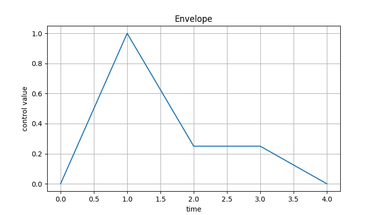

Tutorial 5: Audio musaicking parameters
=================================================

One of the main advantages of the ``Mosaic`` class, is that it allows to generate different audio mosaic versions
from the same instance, or `corpus-target` pairing. In other words, a ``Mosaic`` instance works as a virtual representation, 
or **blueprint** of an `audio mosaic`, rather than the `audio mosaic` itself. 

This allows to play and experiment with different settings, hear the results, all without having to rebuild the 
``Corpus`` and/or the ``Mosaic`` from scratch everytime. Thus, the resulting audio will depend on the many 
audio parameters one can pass to the ``to_audio()`` method.

To demonstrate this, let's consider different cases with the same ``Mosaic`` instance. 

.. code:: python

    from gamut.features import Mosaic

    # first load .gamut mosaic from disk
    mosaic = Mosaic().read('/path/to/my_mosaic.gamut')

Now, let's generate audio using the default arguments:

.. code:: python

    # convert to audio mosaic using arguments and play it.
    mosaic.to_audio().play()

Optionally, we can pass different arguments to fine-tune the final output. For instance, setting the `grain duration`:

.. code:: python

    # set grain duration to 0.5 seconds
    mosaic.to_audio(grain_dur=0.5).play()

As with most of arguments in the ``to_audio()`` method, we can use a ``list`` of values to dynamically (i.e., over time) change the parameter.

.. code:: python

    # set grain duration, gradually changing from 0.1 to 0.5 seconds, over the duration of the audio file
    mosaic.to_audio(grain_dur=[0.1, 0.5]).play()

Similarly we can customize the grain envelope:

.. code:: python

    env = [0, 1, 0.25, 0.25, 0]
    mosaic.to_audio(grain_env=env).play

This would result in the following grain envelope:



.. warning::
    When specifying envelopes as a ``list``, make sure that the envelope **starts and ends** in ``0``. Otherwise, you'll likely get audio clippings in the audio output with every grain.


Another convenient way of specifying time-varying or `dynamic` parameters, is through a 
``list`` of ``tuples``, here each ``tuple`` is the (`x, y`) coordinates of the parameter — 
`x` being time, and `y` being the parameter value. 

.. code:: python
    
    env = [
        (0, 0), 
        (1, 1), 
        (2, 0.25), 
        (10, 0),
    ]
    mosaic.to_audio(grain_env=env).play

This results is the following grain envelope:

.. image:: ../_static/grain-env-2.png
    :height: 250px

.. warning::
    When specifying a control parameter as a ``list`` of ``tuples``, make sure the `x` values appear in incremental order. For instance, these ``lists`` would all throw an error: 

    * ``[(0, 0), (0, 1)]```
    * ``[(0, 0), (1, 1), (0, 1)]```
    * ``[(0, 0), (1, 1), (50, 0.5), (10, 0)]```

Finally, let's consider a more complex version, changing more than a single parameter.

In this case, we'll change:

* ``corpus_weights``: This controls the likelihood of using the `corpus` (instead of the original audio `target`) for a given segment or `grain`. By default, this is set to ``1``. Although it's not quite the same, this is somewhat equivalent to controlling the dry-wet mix between corpus and target.
* ``grain_env``: grain envelope.
* ``grain_dur``: grain duration, in seconds.
* ``stretch_factor``: inverse playback rate, where 2 is twice as slow, 0.5 is twice as fast, and so on.

.. code:: python

    # gradual change, from only using grains in corpus, to only using grains in original audio target
    corpus_weights = [1, 0]

    # a somewhat sharp and percussive grain envelope
    grain_env = [
        (0, 0),
        (1, 1),
        (2, 0.5),
        (15, 0),
    ]

    # playback at original speed (1.0), and half way gradually slow down to twice the speed (2.0)
    stretch_factor = [1, 1, 2]

    # convert to audio
    audio = mosaic.to_audio(
        grain_env=grain_env,
        corpus_weights=corpus_weights,
        stretch_factor=stretch_factor,
    )

    # playback audio mosaic
    audio.play()

    # write audio mosaic to disk
    audio.write('./my_cool_audio_mosaic.wav')

.. note::
    To learn more about all available audio parameters, see the documentation: :class:`gamut.features.Mosaic.to_audio`.
